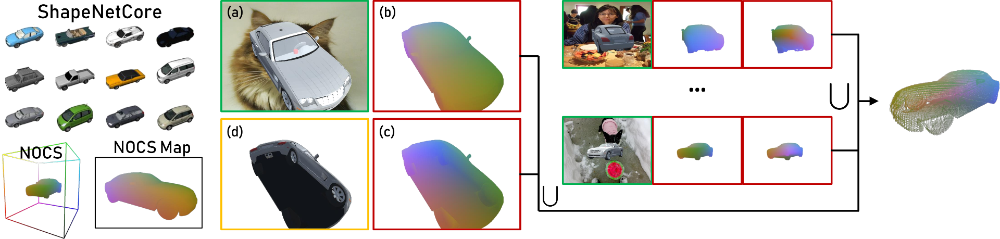

# Multiview Aggregation for Learning Category-Specific Shape Reconstruction
## NeurIPS 2019
<a href="http://srinathsridhar.com/" target="_blank">Srinath Sridhar</a><sup>1</sup>, <a href="https://davrempe.github.io/" target="_blank">Davis Rempe</a><sup>1</sup>, <a href="https://scholar.google.co.uk/citations?user=pZPD0hMAAAAJ&hl=en" target="_blank">Julien Valentin</a><sup>2</sup>, <a href="http://sofienbouaziz.com/" target="_blank">Sofien Bouaziz</a><sup>2</sup>, <a href="https://geometry.stanford.edu/member/guibas/" target="_blank">Leonidas J. Guibas</a><sup>1,3</sup>
<br>
<sup>1</sup><a href="https://www.stanford.edu/" target="_blank">Stanford University</a>, <sup>2</sup><a href="https://vr.google.com/daydream/" target="_blank">Google Inc.</a>, <sup>3</sup><a href="https://research.fb.com/category/facebook-ai-research/" target="_blank">Facebook AI Research</a>



# About
This repository contains the code and datasets for the NeurIPS 2019 paper **Multiview Aggregation for Learning Category-Specific Shape Reconstruction**. If you use the code or datasets please cite our paper.

```latex
@InProceedings{xnocs_sridhar2019,
author = {Sridhar, Srinath and Rempe, Davis and Valentin, Julien and Bouaziz, Sofien and Guibas, Leonidas J.},
title = {Multiview Aggregation for Learning Category-Specific Shape Reconstruction},
  booktitle={Advances in Neural Information Processing Systems (NeurIPS)},
  year={2019}
}
```

# Code
## 1. Download and install the following required packages. We only support Python 3.5+.

- PyTorch 1.0+ (see the [PyTorch website][1] for installation instructions)
- numpy>=1.15.4
- opencv-python<=3.2.0.8
- matplotlib
- palettable (`pip install palettable`)
- [tk3dv][2] (`pip install git+https://github.com/drsrinathsridhar/tk3dv.git`)

## 2. Download the datasets (see below for details)

Note: The training code can automatically download the ShapeNetCOCO dataset. **Please see the dataset [readme][3] for more details.**

- [shapenetcoco_v1.zip (172 GB)][6]
- [shapenetplain_v1.zip (5 GB)][5]

## 3. Sample code

The main training and evaluation code is `noxray/nxm/nxm.py` for the single-view network and `noxray/mv_nxm.py`

To train the single-view network on the cars category in ShapeNetCOCO, use this command:

```
python nxm.py --mode train --input-dir <BASE DATASET DIR> --output-dir <BASE OUTPUT DIR> --expt-name XNOCS_SV --category cars --arch SegNetSkip --seed 0 --data-limit <SKIP THIS TO USE FULL DATA> --val-data-limit <SKIP THIS TO USE FULL DATA>
```

You can also load the above config from a file using the `@` seperator.

To evaluate the network and write the output images, use this command:

```
python nxm.py --mode val --input-dir <BASE DATASET DIR> --output-dir <BASE OUTPUT DIR> --expt-name XNOCS_SV --category cars --arch SegNetSkip --seed 0 --val-data-limit <SKIP THIS TO USE FULL DATA>
```

The multi-view network commands are very similar to the above.

# Datasets

We provide two datasets: ShapeNetCOCO and ShapeNetPlain. ShapeNetCOCO is the primary dataset of which we demonstrate reconstruction results. ShapeNetPlain is the dataset we use for comparison with 3D-R2N2 and DPC.

- [shapenetplain_v1.zip (5 GB)][5]
- [shapenetcoco_v1.zip (172 GB)][6]

**Please see the dataset [readme][3] for more details.**

# Contact

Srinath Sridhar ([ssrinath@cs.stanford.edu][4])

[1]: https://pytorch.org/
[2]: https://github.com/drsrinathsridhar/tk3dv
[3]: dataset/README.md
[4]: mailto:ssrinath@cs.stanford.edu
[5]: http://download.cs.stanford.edu/orion/xnocs/shapenetplain_v1.zip
[6]: http://download.cs.stanford.edu/orion/xnocs/shapenetcoco_v1.zip
